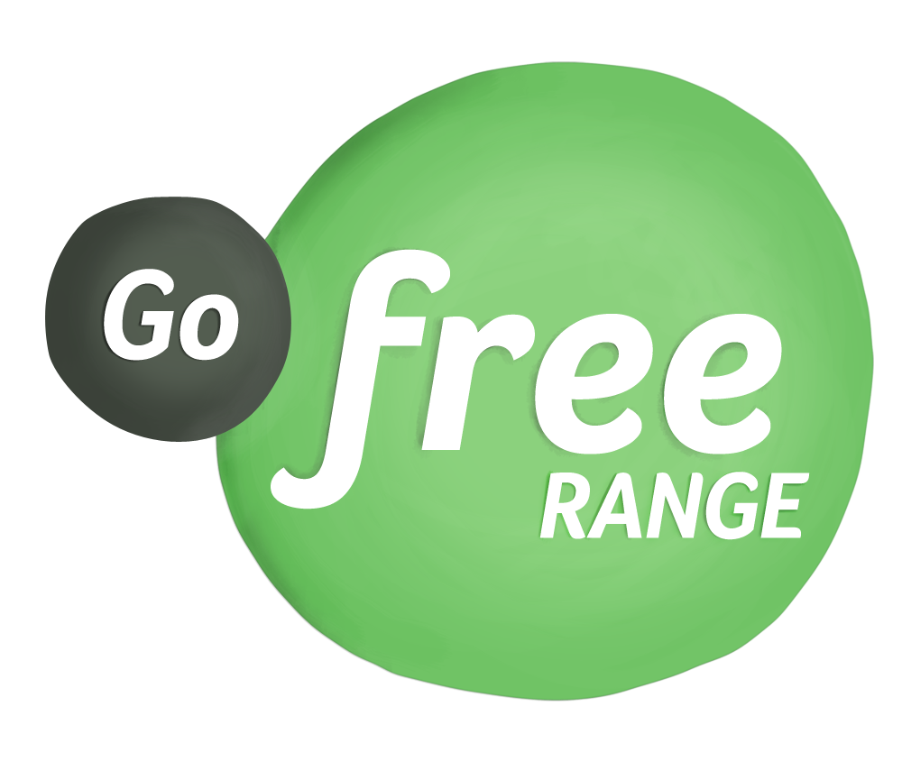
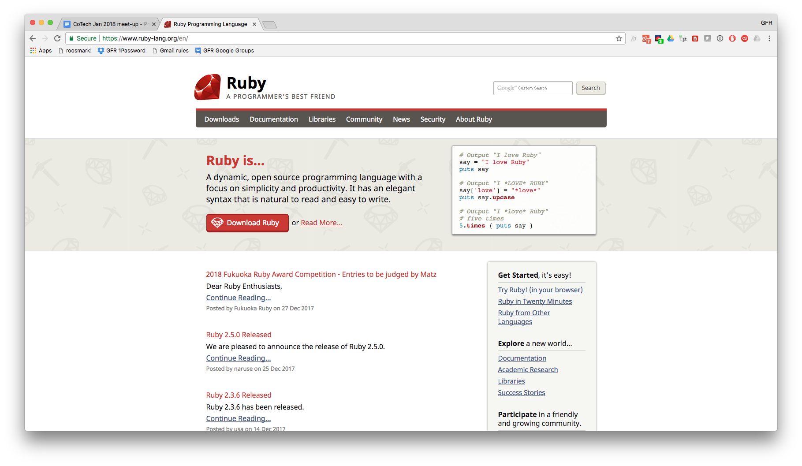
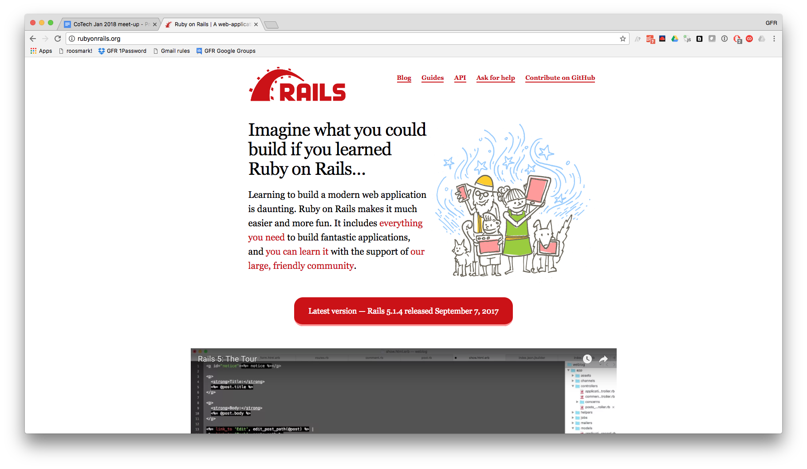
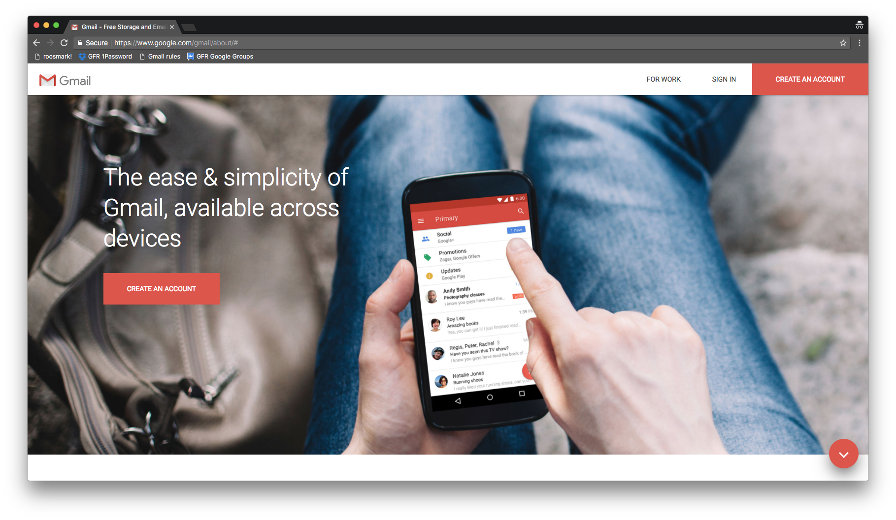
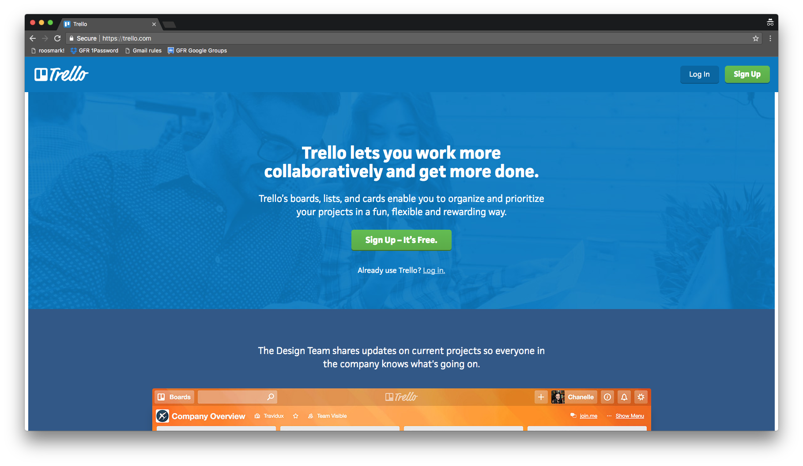
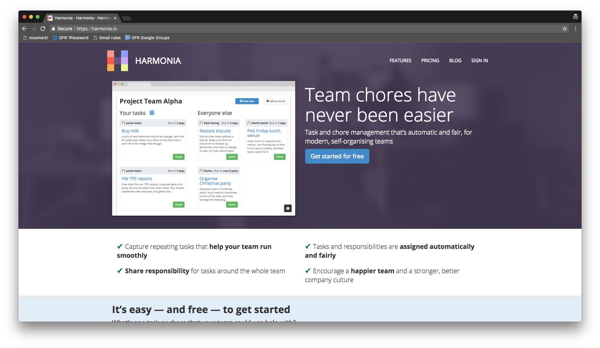
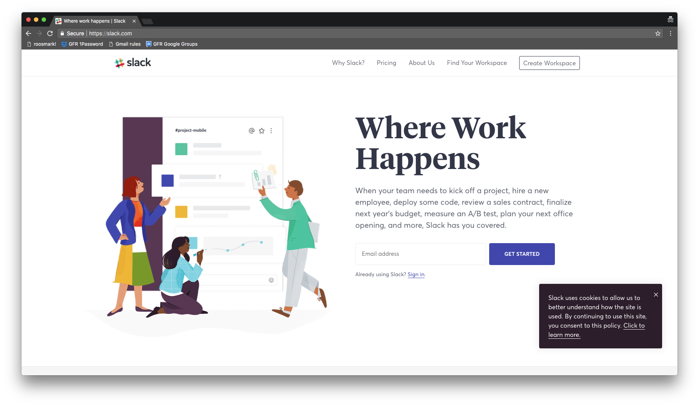
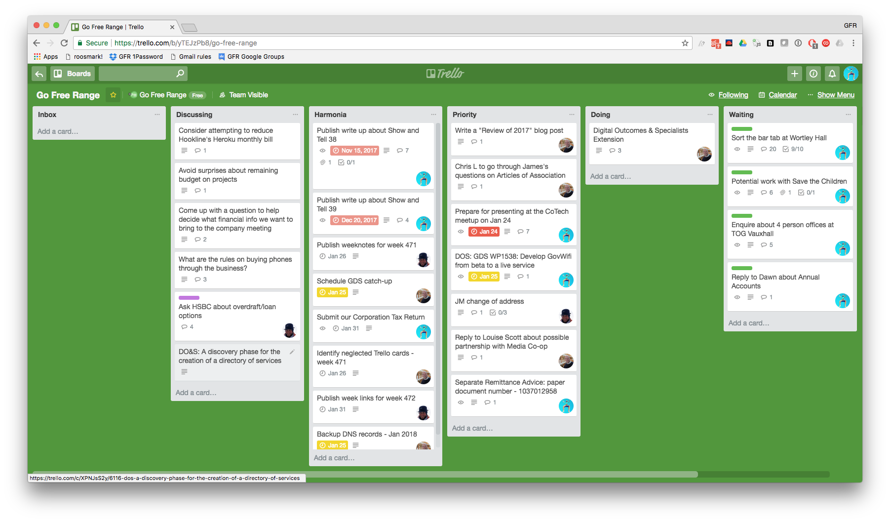

^
- I'm Chris from Go Free Range
- Go Free Range is often abbreviated GFR and I might switch between the two during the talk

---

# Overview

* About us
* Tools and processes
* Benefits and challenges

^
I'm going to talk about:
- our company structure
- the tools and processes we use to run the company without a boss, and
- the benefits and challenges of working the way we do

---

# [fit] **About us**

^
- We're a software company

---

# [fit] Ruby

^
- Very experienced Ruby developers

---

# [fit] Ruby on Rails

^
- specialises in Ruby on Rails development
- Ruby on Rails is a web development framework.

---

# [fit] 2009

^
The company was started in 2009

---

# [fit] Chris joins

* Chris :heart:
* Kalv
* James A
* James M
* Jase
* Tom

^
- I joined as the 6th member in 2010
- Which started the slow leak of 4 of those members out of the organisation
- 3 even went as far as emigrating!

---

# [fit] Kalv :heart: Vancouver

^
- Kalv moved to Vancouver

---

# [fit] Jase :heart: Paris

^
- Jase moved to Paris

---

# [fit] James :heart: Austin

^
- James moved to Austin

---

# [fit] Tom :heart: Basecamp

^
- Tom defected to Basecamp
- Formerly 37signals
- Created Rails!

---

# [fit] 50% increase in headcount!

^
- We finally managed to reverse that trend last year when we increased our headcount by 50%!
- That’s right - we took on a single new member in the form of Chris Lowis

---

# [fit] O2

^
- We’ve been fortunate enough to have three main clients that have helped sustain us since we began

---

# [fit] FutureLearn

^
- Open University backed online education platform

---

# [fit] Government Digital Service

^
- We worked on the GOV.UK content management system

---

# Structure

* Private company limited by shares
* We're a co-op(ish)

^
* I’m relatively comfortable describing ourselves as a worker co-op and we’re in the process of updating our Articles of Association so that they’re compatible with Coops UK.

---

# Roles

* Directors
* Equal shareholders
* Employees

---

# Responsibilities

* Running the company
* Client and non-client work

---

# Remuneration

* Equal pay
* Monthly pay
* Annual pay reviews

^
* We keep money in the company to ensure we can pay ourselves in the absence of client income

---

# [fit] **Tools & Processes**

^
- What we do day-to-day to keep the company running, specifically how we capture work we need to do and how we keep on top of that work
- The idea is to minimise the amount of admin required so we can focus on the work we enjoy and get paid for
- Mostly asynchronous which means that we don’t all have to be working together at the same time, e.g. Chris is in Colombia right now
- Single face-to-face (physical or virtual) meeting each week to do the things that are harder to do asynchronously

---

# [fit] Email

^
- Single company email address
- We try to encourage people to email our group address so that no single member becomes responsible for something

---

# [fit] Trello

^
- Single board for running the company
- Single place to help decide what needs to be done

---

# [fit] Harmonia

^
- Random assignment of our recurring tasks

---

# [fit] Slack

^
- Real-time(ish) communication

---

# [fit] Process

^
- It’s evolved over time and has been influenced by software development practices like eXtreme Programming (XP) and Lean, and personal productivity practices like Getting Things Done (GTD).

---

^
- Central to the process is our Trello board
- We use a single board containing 6 lists to organise our work (represented as cards)

---

# Trello board lists

* Inbox
* Discussing
* Harmonia
* Priority
* Doing
* Waiting

---

# Inbox

- Ad-hoc cards
- Processed daily
- Example: New client enquiry

^
- Cards might be added based on an email we receive
- Or based on an idea we've had

---

# Discussing

- Non-actionable cards
- Neglected cards
- Processed weekly
- Example: Ask HSBC about overdraft/loan options

^
- Non-actionable is something that doesn't have an obvious next step. E.g. a card expressing an idea we've had that we want to discuss in the group
- Example was identified as neglected recently

---

# Harmonia

- Tasks assigned by Harmonia
- Mostly recurring tasks
- Processed regularly
- Example: Pay our wages

^
- Processed regularly - ideally before the due date
- We introduce new tasks when we notice a pattern (e.g. put process in place to go through DO&S opportunities)

---

# Priority

- Tasks assigned manually
- Mostly ad-hoc tasks
- Processed regularly

^
- Assigned when processing the Inbox

---

# Doing

- Being worked on

---

# Waiting

- Things we're waiting on

---

# Maintaining the board

---

# Process Inbox

- Daily
- Clear the inbox
- Do it, assign it, move it to Discussing

^
- Task assigned by Harmonia

---

# Identify neglected cards

- Weekly
- Identify cards with no recent activity
- Move cards to the Discussing list

^
- Task assigned by Harmonia

---

# Discuss cards

- Weekly
- Improve and move
- Delete them

^
- Processed weekly during company meeting
- Collectively decide what to do about them
- Make them actionable and move them to Inbox or Priority
- Potentially delete them. If they’re important we’ll remember them.

---

# Company meeting

1. Prepare for coming week
2. Business development
3. Discussing column
4. Retrospective

^
- 1. Look at calendar to remind us what we've got coming up in the next week
- 2. Discussing any leads that have come in during the week
- 3. Collectively try to unblock any non-actionable/neglected cards
- 4. Celebrate what’s gone well and identify things that can be improved

---

# [fit] Recurring tasks

^
I'm going to quickly run through some examples of the tasks that go through this process

---

# Bookkeeping

- Pay our wages and pensions
- Pay Corporation Tax, VAT and PAYE
- Prepare and send invoices

---

# Client management

- Schedule regular meetings

---

# Social

- Monthly drinks
- Monthly Show & Tell
- Quarterly company away day

---

# Blogging

- Weekly blog post
- Show & Tell write-ups

^
- We use our weeknotes to be transparent about what we're doing and help reflect on what we've done

---

# Business development

- Maintain a spreadsheet of leads
- Go through DO&S opportunities

^
- Digital Outcomes and Specialists are part of the Government's Digital Marketplace

---

# [fit] **Benefits & Challenges**

---

# Benefits of our process

- Organisational resilience
- Lower barrier for new members
- No knowledge silos

^
- Distributing responsibility for running the company should mean it's more resilient to change in membership.
- Chris was able to submit our VAT return within his first couple of weeks. Something he had no prior experience of doing.
- Avoid the problem of power inequality through knowledge

---

# Benefits of co-operating

- Control over what we do
- Flexible working
- Selling point
- Last company we work for?

^
- Control over what we work on
- James and I worked in Switzerland and New Zealand respectively
- Chris is currently working in Colombia
- Paying the people that do the work and run the company. It's in our best interest to do a good job.
- I'd like to think we can continue to evolve the company to support our changing needs.

---

# Challenges

- Admin overhead
- Decision making
- Equal effort
- Members leaving and joining
- 4 members left!
- Lack of diversity

^
- Running the company still takes quite a large chunk of our time. Maybe we do too much.
- We definitely struggled on occasion when there were 6 of us. It's easier with 2 or 3 but still requires effort.
- I'm worried that things aren't necessarily fair in terms of working vs holiday time. Our contributions are mostly based on an honesty system given that we don't track our non-client time or holidays
- We don't have a process for members leaving and joining. It's probably been slightly different each time it happens.
- We've clearly got some way to go if this really is going to become the last company we want to work for.
- There's an obvious lack of diversity in our all-white, all-male group. We're aware of this and would like to do something about it.

---

# Thanks

- James Adam
- James and Chris
- Outlandish

^
- James Adam for starting Go Free Range, encouraging me to join and for his continued work on Harmonia
- James and Chris for their continued help and support in running Go Free Range
- Outlandish for introducing us to CoTech and the like-minded people it contains. All of which has encouraged us to more formally adopt the cooperative principles.
